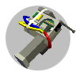

# 

Renderman is a mysterious entity that haunts Blockland. Over the years, this entity has become increasingly intelligent... and increasingly deadly.

## Why v20? Why not continue for v21?
I personally prefer playing in v20, and since this version of Render works fine for v21 (as well as having compatibility features for v20) I decided to fully port it over for v20. This includes removing many of the features that are v21 exclusives, like
day/night cycle detection for spawning for example. I also want to kind of use this as a learning experience for myself, and be able to upload this to B4v21's RTB repository (if you haven't noticed, this fork prioritises B4v21.)

------------ | ------------- | ------------- |

## What's New in the Halloween 2019 Update
+ Renderman types
+ Mysterious structures may appear if you have the "Affect bricks and lights" preference enabled
+ A new look for the Glitch Detector and, finally, a Glitch Gun model!
+ Render Nights - A new option for survival servers
+ Appearance modifiers - Custom mods to edit Render's appearance
+ Even more assorted features and fixes

## The Glitch Detector

This is the Glitch Detector. This tool will alert you to the presence of Render by measuring "glitch energy". It will notify you if dangerous levels of energy are found.

## The Glitch Gun

The Glitch Gun is a one-time use item that can be used to defend against Renderman. Upon use, the gun will explode, taking any nearby threats with it.

## Glitch Shrines

The Glitch Shrine is a brick that you can place in your builds to passively repel Render. Glitch Shrines have the appearance of a Jack-o-lantern. You can make a shrine invisible by hitting it with a wrench and unchecking "Rendering".

You can turn a shrine off by hitting it with the wrench and unchecking "Raycasting" in the menu. You can also do this automatically with events.

## Detector Bricks

These are special bricks that trigger **onRelay** when Render is nearby. You can use these to make automated alarm systems and other things for your builds. For advanced uses, the detection level of a brick can be changed using the "setRDetectorLevel" event.

## Preferences
If you have Blockland Glass or another preference manager installed, you will be able to re-configure Renderman's behavior.
- **Mode** - Changes Render's behavior. There are four modes to choose from: *Normal* (Render acts normal as always), *Damage* (Render drains players' health), *Tag* (Render kills on touch rather than on sight), and *Haunt* (Render is passive and does not attack).
- **Spawn Rate** - Adjust this to change how often Render spawns. Setting this to 'Disabled' will turn Render spawning off.
- **Shrine Range** - This changes the area of effect for Glitch Shrines. Set this to 'Disabled' to turn shrines off entirely.
- **Shrines admin only** - When enabled, only shrines placed by administrators will work.
- **Minigame prefs admin only** - When enabled, minigame events and Slayer configurations will only work for administrators.
- **Affect bricks and lights** - Allows Render to flicker lights and place bricks.
- **Daytime spawning** - With this enabled, Render will spawn in bright environments.
- **Disable ambient sounds** - Checking this turns off ambient sound effects.
- **Disable lights** - When checked, Render will not use lights.
- **Invincible** - Turn this on to make Render invincible. When turned off, weapons can be used against Render.
- **Nights** - When day/night cycle is on, there is a random chance each night of Render attacking. This pref determines the chance of spawning, or "Disabled" to turn it off.
- **Nights message** - Message that displays when a night begins and Render is about to attack. Can be left blank to disable.
- **Transform chance at spawn** - The rate at which players will spawn as Render.

### Slayer Support
This add-on supports Slayer mini-games. The following preferences can be changed in a Slayer mini-game under the Advanced settings:
- Invincibility - Changes whether Render is invincible or not.
- Mode - Changes Render's mode.
- Player Transformation Rate - How often players will spawn as Render.
- Points for Killing Render - How many points are awarded for defeating Render with a weapon.
- Spawn Rate - Changes Render's spawn rate.
By default, these preferences are set to 'Use Server Preference', meaning that the server's configuration will apply as usual.

### Events
You can change Render's behavior in a mini-game using events. The events only work if you are the mini-game owner and they ONLY affect the mini-game.
- MiniGame -> setRenderInvincibility
- MiniGame -> setRenderMode
- MiniGame -> setRenderSpawnRate

# Update History
- v2.2 - The Holiday Cheer Update
- v2.1 - The Halloween 2018 Update
- v2.0.1 - Detector Brick Hotfix
- v2.0 - The Halloween 2017 Update
- v1.4 - Events and Interactivity
- v1.3 - The Slayer Update
- v1.2.1 - Mystery Update Reveal
- v1.2 - The Mystery Update
- v1.1 - Glitch Guns

# See also
- Flickering Player Light (Direct download): http://blockland.us/files/Light_Flickering_Player_Light.zip
- Flashlight: https://forum.blockland.us/index.php?topic=240727.0
- Prepper Script: https://forum.blockland.us/index.php?topic=178185.0
- Support_Prepper (Old): https://forum.blockland.us/index.php?topic=174563.0

*By LakeYS - http://LakeYS.net*
*Continued and ported fully for v20 by Sveny - https://sveny.tf*

# Project Goal
The goal of this project is to create a polished survival horror experience that conforms to Blockland's non-linear gameplay style.

# Project Accomplishments
Here are a few things that have been successfully accomplished in this project.
- A lightweight node generator for spawning and movement that can, in many cases, detect and navigate around corners of players' builds.
- Original sound effects and ambience created specifically for the mod.
- A functioning set of "horror mechanics" that do not rely on cheap jump-scares or loud noises.
- Interactive items, events (scriptable elements), configuration, and brick types that allow for unique gameplay.
- Polished visual effects.
- Partial reverse-compatibility with older versions of Blockland
